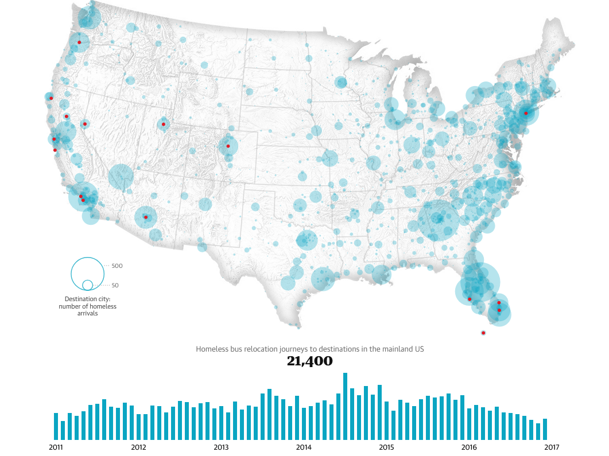

```{r, echo = FALSE}
knitr::opts_chunk$set(warnings = FALSE, message = FALSE)
library(tidyverse)
library(ggplot2)
```

[NYC Flights]
```{r}
library(nycflights13)
flights |> select(carrier, air_time, distance)
```

Part A
```{r}
flights <- mutate(flights,
  speed = distance / air_time
)
flights
```


Part B
```{r}
ggplot(flights, aes(carrier, speed)) +
  geom_boxplot()
``` 
The boxplot above provides a very basic analysis of the average speed of each carrier. With this, we are able to see carrier 'HA' has the highest average speed of any of the carriers. Even though some of the carriers do have higher 'highs', HA still on average is faster than the others.

[London Olympics]
```{r}
olympics <- read_csv("https://uwmadison.box.com/shared/static/rzw8h2x6dp5693gdbpgxaf2koqijo12l.csv")
```

Part A/B
```{r}
counts <- olympics |>
  count(Sport)

olympics |>
  left_join(counts) |>
  filter(n > 5) |>
  ggplot() +
  geom_boxplot(
    aes(Age, reorder(Sport, Age, sd))
  )
```

Part C
Average height(cm) among sports. See if there's a noticeable difference in the height among athletes that participate in different sports. Following the same idea as the age distribution, I created a visualization on based on height. 
```{r}
olympics |>
  left_join(counts) |>
  filter(n > 5) |>
  ggplot() +
  geom_boxplot(
    aes(`Height, cm`, reorder(Sport, `Height, cm`, sd))
  )
```

There does not seem to be a very noticeable difference in height, except in basketball, which does make sense.

[Pokemon]
```{r}
pokemon <- read_csv("https://uwmadison.box.com/shared/static/hf5cmx3ew3ch0v6t0c2x56838er1lt2c.csv")
```

Part A
```{r}
pokemon <- mutate(
  pokemon,
  'attack-to-defense' = Attack / Defense
)
pokemon |> select('attack-to-defense')
```

Part B
```{r}
pokemon <- pokemon |>
  group_by(type_1) |>
  mutate(`attack-to-defense-median` = median(`attack-to-defense`, na.rm = TRUE)) |>
  ungroup()
pokemon
```

Part C
```{r}
pokemon$type_1 <- reorder(pokemon$type_1, desc(pokemon$`attack-to-defense-median`))

ggplot(
  pokemon,
  aes(`attack-to-defense`)
  ) +
  geom_dotplot() +
  facet_wrap("type_1", scales = "free_x") +
  theme_classic()
```

Part D

An example dynamic plot could compare the stat totals of Pokemon based on different factors. For example, we could see the difference based on type or legendary status. This would answer how strong some types are or how strong legendary Pokemon are compared to regular Pokemon. The user would be able to select what facet they want to view and the query would update how the stat totals are shown.

[Gene Expression Faceting]
```{r}
genes <- read_csv("https://uwmadison.box.com/shared/static/dwzchdtfca33r0f6i055k2d0939onnlv.csv")
head(genes, 3)
```


[Visual Redesign]


[California Wildfire Alternatives]
```{r}
fires <- read_csv("https://uwmadison.box.com/shared/static/k5vvekf1bhh9e16qb9s66owygc70t7dm.csv") |>
  select(Name, Counties, year, day_of_year, AcresBurned, MajorIncident)
head(fires, 3)
```

Part A
- This visualization approach is well suited for for comparing the distribution of fires throughout the dates in each year shown. We can see somewhat easily when each fire happened during each year.

- This visualization is not well suited for seeing which counties had the most fire damage. Based on how the graphs are structured, we cannot easily tell which counties had the most fires. The counties are arranged in a way that is hard to read the names as well as easily find the exact number of fires that occurred.

Part B
- This visualization is good for comparing the damage between the major fires from each year. We can easily see the range of acres burned by each type and are easily able to compare the damage done by each type over each year.

- Again this visualization is not good for comparisons done between areas burned. Since we are not given any information on the area in which each fire occurred we don't know any of this information and thus cannot visually compare it.

Part C
- This visualization is good for comparing the damage the most damaging fires has done. We can easily see the name of the fire and also how much damage the fire did as well as the year it was in. The damage done by acre is clearly illustrated by the boxplot.

Part D
```{r}
fires$Name <- reorder(fires$Name, fires$AcresBurned)
top_fires <- fires |>
  top_n(18, AcresBurned)


ggplot(top_fires, aes(AcresBurned, Name, fill=factor(year))) +
  geom_bar(stat = 'identity') +
  labs(title = "Fires with the Most Acres Burned", x = "Acres Burned", y = "Fire", fill = "Year") +
  theme_classic()
```

[Homelessness]

Part A
The data behind the graph would be the homeless bus relocations in the mainland United States over the period from 2011 to 2017. The rows would the year and the columns would the total number of homeless bus relocations to each city. 

Part B
Both columns would be numeric types as we are tracking quantitative data and can count the total number of bus relocations.

Part C
The data would be encoded by city since each city is given a 'circle' mark to indicate how many people relocated to the city via bus during the time period. The marks would be derived from the number of relocations and the circles follow a exponential scale of the total number of relocations.

Part D
Yes since we are given a map of the US to show visually what cities were the most effected as well as a bar graph that gives a general overview of the change in number of bus relocations over the time period.